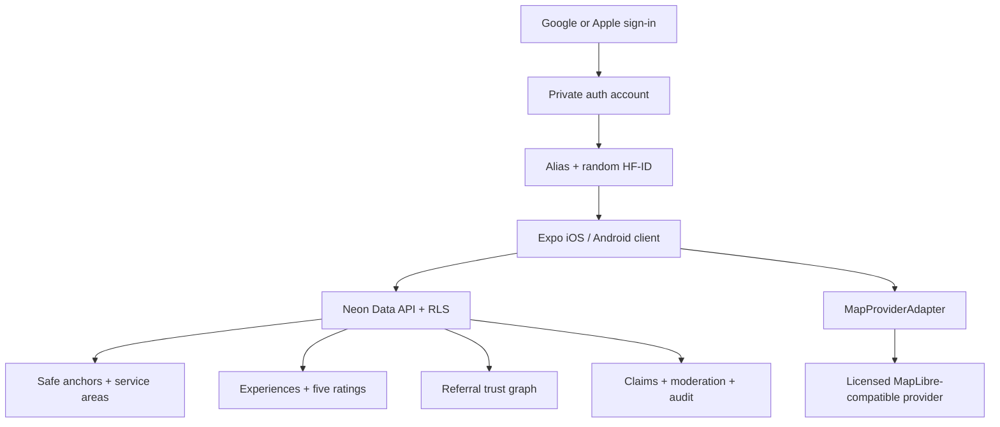

# HouseFriends Architecture

## Geography

`Safe Public Anchor → normalized HouseFriends Service Area → eligible experiences and providers`

Safe anchors are user-facing public references. Service Areas are country-normalized administrative/local coverage units used by providers and, when legally activated, advertising. A provider does not select schools or fire stations to define coverage.

Provider selections store a chosen area plus `include_descendants`; they do not pre-expand every descendant into separate global rows. Border resolution can add adjacent eligible areas.

## Trust

- Provider ratings: latest current contribution from each unique customer, overall and per branch/category when sample size is sufficient.
- Recommender trust: one unique searcher/experience relationship.
- `helpful` upgrades to `verified`; the unique database key prevents double counting.
- Badge snapshots update after referral changes and can be recalculated after deletion or fraud reversal.

## Identity and authorization

- `neon_auth.user` and private account data are not public.
- `public_profiles` contains alias + HF-ID only.
- Individual providers publish alias + HF-ID and optional voluntary trade name.
- Companies publish company/branch names; all human members remain aliases.
- Company RBAC: owner, admin, branch manager, analyst. Policies resolve membership server-side.
- Admin role cannot be self-assigned through onboarding.

## Media

The client re-encodes selected images to JPEG. Production requests an authenticated, short-lived upload ticket from `EXPO_PUBLIC_MEDIA_API_URL`; the media service must enforce a user-prefixed object path and private pending storage. No client can publish an approved path or set the server-side `metadata_stripped` state. Until a production object store and re-encoding/moderation worker are connected, the production environment validator blocks release.

## Authentication boundary

Neon Auth JWTs are validated by the Data API. RLS policies read the JWT subject through Neon's managed `auth.user_id()` helper. Because Data API application roles cannot directly use the managed `auth` schema inside RPC code, an RLS-protected `request_identities` row safely hands the current UUID to security-invoker RPC wrappers; privileged mutations remain in the private schema. Native Expo social sign-in still requires a mobile-ready Better Auth/Expo or external OIDC deployment before store submission.

## Controlled release gates

- Sponsored campaigns require `enabled`, `legal_approved`, and `billing_approved` in the country gate.
- Regulated categories require country/region legal approval and never imply license verification without a configured authority source.
- Video media is disabled.
